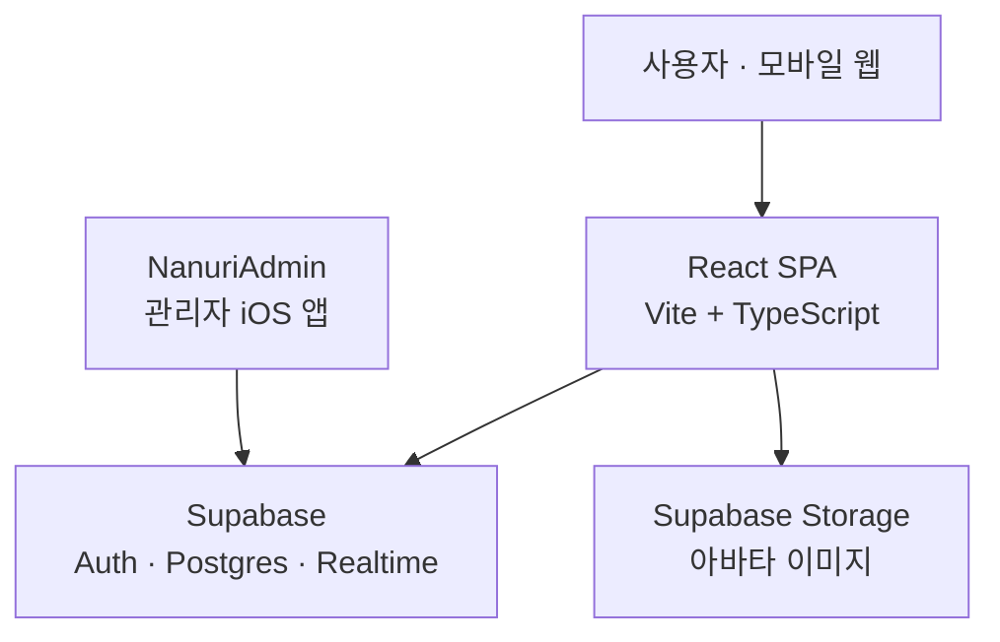

# 나누리 (Nanuri) — 청년부 찬양팀 일정 조율

교회 청년부 찬양팀이 **주일마다 누가 어느 자리에 서는지** 함께 정하는 모바일 웹앱입니다.
멤버가 자기 포지션에 "설 수 있음"을 토글로 표시하면, 같은 화면을 보고 있는 다른 사람에게
실시간으로 반영됩니다.

**이 앱이 하는 일은 이것 하나입니다.** 예전에 있던 비용 청구·행사 운영·소모임·회계는
2026-08-28 에 걷어냈거나 관리자 iOS 앱으로 넘어갔습니다.

개발 문서는 [docs/](docs/)에 있습니다 — 구조·라우팅·데이터 모델·코드 규칙·진행 상태를 나눠
정리했습니다. AI 에이전트로 작업한다면 [CLAUDE.md](CLAUDE.md)부터 보세요.

## 기능

### 찬양팀 일정 (`/worship`)

주일 날짜를 고르면 포지션 10칸(인도자 · 싱어1 · 싱어2 · 메인 피아노 · 세컨 피아노 ·
어쿠스틱 · 베이스 · 일렉 · 드럼 · PPT)이 뜹니다. 자기 포지션 칸을 눌러 참여를 표시하고,
이미 다른 사람이 선 자리를 누르면 **교체 확인**을 거칩니다. 변경은 Supabase Realtime 으로
즉시 퍼집니다. 팀(나누리 · 섬김이)으로 나눠 봅니다.

### 프로필 (`/profile`, `/member/setup`)

이름 · 팀 · 포지션 · 연락처 · 사진. **포지션을 고르지 않으면 일정 화면의 슬롯에 뜨지
않으므로**, 내정보에서 비어 있을 때 안내합니다.

### 인증

구글 OAuth 하나입니다. 실제 접근 차단은 Postgres RLS 가 하고 `ProtectedRoute` 는 UX 가드입니다.

## ⚠ Supabase 프로젝트를 관리자 앱과 공유합니다

관리자 iOS 앱 **NanuriAdmin** 과 같은 Supabase 프로젝트를 씁니다. 2026-08-13 에 그쪽
마이그레이션의 `drop schema public cascade` 가 이 앱의 테이블을 전부 지웠고 데이터는 복구하지
못했습니다. **스키마를 건드리기 전에** [docs/status.md](docs/status.md#-2026-08-13-스키마-삭제-사고)를
읽으세요. R2 버킷 `nanuri-bills` 도 공유 자원이라 지우면 안 됩니다.

## 기술 스택

| 영역 | 사용 |
| --- | --- |
| 프론트엔드 | React 19 · TypeScript · Vite |
| 스타일 | Tailwind v4 (`@theme` 토큰 — [docs/design.md](docs/design.md)) |
| 상태 | TanStack Query (서버) · Zustand (인증) |
| 백엔드 | Supabase — Auth · Postgres · Realtime · Storage |
| 애니메이션 | motion/react |
| 배포 | Vercel (`main` 푸시 시 자동) |

외부 의존성은 **Supabase 하나**입니다. Cloudflare Worker/R2 와 Claude API 는 2026-08-28 에
끊었습니다([docs/architecture.md](docs/architecture.md#cloudflare-를-끊은-이유)).



## 시작하기

### 1. 의존성 설치

```bash
npm install
```

### 2. 환경 변수

프로젝트 루트에 `.env` 를 만들고 채웁니다.

```env
VITE_SUPABASE_URL=
VITE_SUPABASE_ANON_KEY=
```

`db push` 에 쓰는 `SUPABASE_DB_PASSWORD` 는 `.env.local` 에 둡니다. **값을 출력하지 마세요** —
자세한 이유와 쓰는 법은 [CLAUDE.md](CLAUDE.md#db-비밀번호)에 있습니다.

### 3. 개발 서버

```bash
npm run dev
```

로그인 없이 화면만 보려면 `/__dev/` 로 접속하세요. 개발 전용 미리보기 목록이 뜹니다
([docs/status.md](docs/status.md#화면-확인하는-법)).

### 4. 빌드 · 검사

```bash
npm run build    # tsc -b && vite build — 타입 에러가 있으면 실패합니다
npm run lint
```

## 데이터베이스

현재 스키마는 `supabase/migrations/` 의 **`20260828` 로 시작하는 두 파일**에 전부 있습니다.
그 이전 파일들은 삭제된 기능(행사·소모임)의 기록입니다.

```bash
set -a; . ./.env.local; set +a; npx supabase db push --dry-run   # 항상 먼저
```

테이블·RLS·Realtime 은 [docs/data-model.md](docs/data-model.md)에 정리돼 있습니다.

## 배포

**`main` 에 push 하면 Vercel 이 프로덕션을 자동 배포합니다**(`nanuri.vercel.app`).
따로 손으로 배포할 것은 없습니다 — DB 마이그레이션만 `supabase db push` 로 밉니다.

## 라이선스
