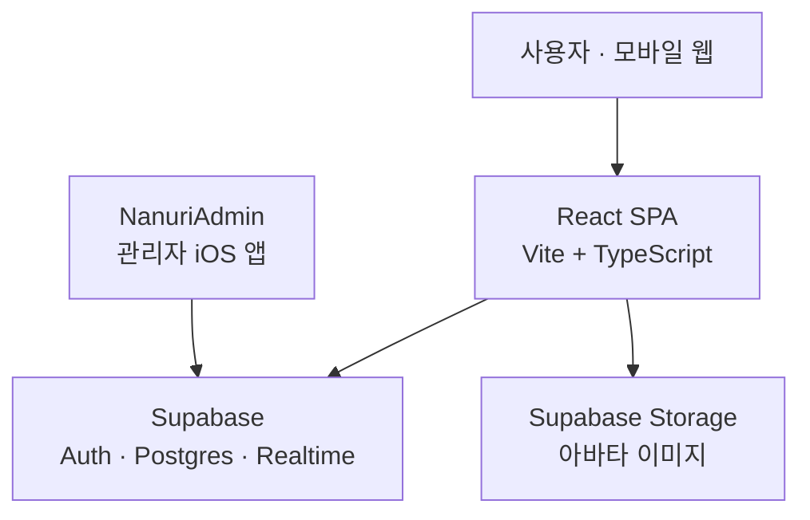

# 아키텍처

## 전체 구성



⚠ **Supabase 프로젝트를 관리자 iOS 앱과 공유합니다.** 이 그림에서 제일 중요한 화살표는
`Admin → Supabase` 입니다 — 그쪽 마이그레이션 하나가 2026-08-13 에 이 앱의 테이블을 전부
지웠습니다([status.md](status.md#-2026-08-13-스키마-삭제-사고)).

백엔드 서버가 따로 없는 **클라이언트 직결 구조**입니다. SPA가 Supabase 하나만 직접 호출하고, 권한 제어는 라우터(UI)와 Postgres RLS(데이터) 두 겹으로 걸립니다. RLS가 실질적인 보안 경계이고 `ProtectedRoute`는 UX용 가드입니다. 자세한 정책은 [data-model.md](data-model.md)를 보세요.

## 외부 의존성

| 대상 | 용도 | 설정 |
| --- | --- | --- |
| Supabase | 인증(익명 로그인 포함), Postgres, Realtime 구독 | `VITE_SUPABASE_URL`, `VITE_SUPABASE_ANON_KEY` |
| Supabase Storage | 아바타 이미지 (`avatars` 공개 버킷) | 위와 같은 클라이언트 |

**외부 의존성은 Supabase 하나입니다.** 2026-08-28 에 Cloudflare(Worker `nanuri-bill` + R2)와
Claude API(Edge Function `generate-description`)를 둘 다 끊었습니다. 아래 "Cloudflare 를 끊은
이유" 참고.

## Cloudflare 를 끊은 이유

아바타 이미지만 Cloudflare Worker(`nanuri-bill`) → R2 로 올리고 있었습니다. 영수증 업로드에서
출발한 경로인데 청구 기능이 사라지면서 아바타 하나만 남았습니다.

끊은 근거는 둘입니다.

- **그 Worker 는 인증이 없었습니다.** 모든 응답에 `Access-Control-Allow-Origin: *` 가 붙고
  토큰 검사가 없어, URL 만 알면 누구나 업로드·삭제할 수 있었습니다. 카카오 역지오코딩
  프록시(`/geocode`)도 열려 있어 남의 API 쿼터를 태울 수 있었습니다.
- **Supabase Storage 에 공개 `avatars` 버킷이 이미 있었습니다.** 관리자 앱이 만들어 둔
  것이라 새로 살 것도 없었고, 옮기면 접근 제어가 RLS 로 들어옵니다.

지금은 [`lib/uploadAvatar.ts`](../src/lib/uploadAvatar.ts)가 Storage 에 직접 올립니다.
경로는 `avatars/<auth.uid()>/<uuid>.<ext>` 이고, **첫 폴더가 본인 uid 인지**를 Storage 정책이
검사합니다([20260828010000_avatar_storage_policy.sql](../supabase/migrations/20260828010000_avatar_storage_policy.sql)).
경로 규칙을 바꾸면 정책도 같이 바꿔야 합니다.

### 남은 정리 — Cloudflare 자원은 지우면 안 됩니다

| 자원 | 처리 |
| --- | --- |
| Worker `nanuri-bill` | ⛔ **두세요.** 관리자 앱 워커가 서비스 바인딩으로 부릅니다 (아래) |
| R2 버킷 `nanuri-bills` | ⛔ **두세요.** 관리자 앱이 같이 씁니다 (아래) |
| R2 버킷 `church-files` | ⛔ 이 프로젝트와 무관합니다. 소유주 확인 전엔 두세요 |
| Vercel 환경변수 `VITE_CF_WORKER_URL` | 지우세요 — 이건 안전합니다 |

**이 저장소는 Cloudflare 를 안 쓰지만, Cloudflare 자원을 지울 수는 없습니다.** 코드에서 끊는
것과 계정에서 지우는 것은 다른 문제입니다.

⚠ **Worker `nanuri-bill` 은 관리자 앱이 부릅니다.** 배포된 `nanuri-form`(버전 c52086de,
2026-08-18)의 바인딩을 확인했습니다:

```
env.RECEIPT_WORKER (nanuri-bill)    Worker
```

`nanuri-form/src/index.js` 의 `uploadReceipt()` 가
`env.RECEIPT_WORKER.fetch('https://receipt-worker/upload')` 로 넘깁니다. 즉 **공개 청구 폼**
(`nanuri-form` 이 `GET /` 로 직접 서비스합니다) → `nanuri-form` → **`nanuri-bill`** → R2 가 지금
살아 있는 경로입니다. 지우면 영수증 접수가 깨집니다.

> NanuriAdmin 저장소에 **이 의존을 걷어내는 작업이 진행 중**입니다 — 버킷을 직접 바인딩하고
> 업로드 코드를 `worker/src/receipts.js` 로 가져오는 변경이 작업 트리에 있습니다. 다만
> **커밋도 배포도 되지 않았습니다.** 그게 배포된 뒤에야 `nanuri-bill` 을 지울 수 있습니다.

⚠ **`nanuri-bills` 버킷도 공유입니다.** 관리자 앱 워커(`nanuri-form`)의 `wrangler.toml` 에
이렇게 적혀 있습니다 — "bucket_name 은 `nanuri-bill` 이 쓰던 것과 **같은 버킷**이어야 한다.
다른 버킷을 적으면 이미 올라간 영수증을 못 지운다." 즉 공개 청구 폼으로 들어온 영수증 이미지가
이 버킷에 있고 `bills.receipt_url` 이 그걸 가리킵니다. 지우면 관리자 앱의 영수증이 전부
깨집니다.

버킷 안에는 옛 웹 업로드(영수증·소모임 썸네일·아바타 — 2026-08-13 에 참조가 끊긴 고아)와
관리자 앱의 살아 있는 영수증이 **섞여 있습니다.** 객체 이름만으로 가르기 어려우니 정리한다면
`bills.receipt_url` 목록과 대조해야 합니다. 급하지 않습니다(전체 42.6MB / 49개).

> 이건 [status.md의 DB 사고](status.md#-2026-08-13-스키마-삭제-사고)와 **같은 종류의
> 함정**입니다 — 공유 자원을 한쪽이 자기 것으로 오해하는 것. Supabase 든 R2 든, 지우기 전에
> 반대쪽 저장소를 grep 하세요.

## 이미지 업로드 흐름

```
File 선택 → browser-image-compression (1MB / 1200px 이하)
         → supabase.storage.from("avatars").upload(`${uid}/${uuid}.${ext}`)
         → getPublicUrl → user_profiles.avatar_url 에 문자열로 저장
```

클라이언트 진입점은 [`lib/uploadAvatar.ts`](../src/lib/uploadAvatar.ts) 하나이고, 쓰는 곳도
프로필 편집 한 군데뿐입니다. 압축 시 `exifOrientation: -1` 로 회전 보정을 끕니다 — 켜면 EXIF
방향이 두 번 적용돼 눕는 사진이 생깁니다.

## 상태 관리

세 층으로 나뉩니다.

- **Zustand (`store/authStore.ts`)** — 세션·프로필 전역 상태. `initialize()`가 `main.tsx`에서 한 번 실행되어 `onAuthStateChange`를 구독하고, 구독 해제 함수를 반환합니다.
- **TanStack Query** — 서버 데이터 캐시. 지금은 `hooks/useWorshipSchedule.ts` 하나가 쓰며 쿼리 키는 `["worship", year, month]` 입니다.
- **useState/useReducer** — 폼과 로컬 UI 상태.

Realtime 구독은 **`worship_availability` 하나**입니다. 이벤트를 받으면 해당 월의 Query 캐시를 무효화합니다 — 여러 명이 동시에 시트를 보며 토글하는 게 이 앱의 기본 사용 방식이라 이 구독이 핵심입니다.

`staleTime` 은 `useWorshipSchedule` 이 5분입니다. 지정하지 않으면 기본값 0이라 마운트할 때마다 재조회하니, 캐시를 미리 채워 쓰는 개발 미리보기에서 주의하세요([status.md](status.md#화면-확인하는-법)).

## 폴더 구조

```
src/
├── components/          # 공용 컴포넌트
│   ├── nav/creatures.tsx  # 탭바 캐릭터 SVG (지금 쓰는 건 songs·profile 둘)
│   ├── ui/                # Button, TextField, TextArea, SelectField, ActionRow, BottomSheet
│   └── worship/           # PositionSlot
├── constants/           # theme(Primary·Muted), layout(하단 여백), worship(포지션 목록)
├── hooks/               # useWorshipSchedule, useToggleAvailability, useCalendar
├── lib/                 # supabase 클라이언트, uploadAvatar
├── pages/
│   ├── auth/              # GatePage, MemberLoginPage
│   ├── dev/               # 개발 전용 UI 미리보기 (/__dev/*, 라우터 바깥)
│   ├── worship/           # 찬양팀 일정 — 이 앱의 본체
│   ├── ProfilePage.tsx
│   └── MemberProfileSetupPage.tsx
├── index.css            # @theme — 디자인 토큰 (docs/design.md)
├── router/index.tsx     # 라우트 정의
├── store/authStore.ts   # 인증 전역 상태
└── types/worship.ts

supabase/migrations/     # 20260828* 두 파일이 현재 스키마 전부
```

## 빌드·배포

- **프론트엔드는 Vercel 이고 `main` 에 Git 연동돼 있습니다 — `main` 에 push 하면 프로덕션이
  자동 배포됩니다.** 프로덕션 도메인은 `nanuri.vercel.app`(별칭 `nanuri-git-main-…`도 같은 빌드).
  즉 push 가 곧 배포라, 배포하려고 `vercel --prod` 를 따로 부를 필요가 없습니다(부르면 중복 배포).
  `vercel.json` 에 SPA rewrite 가 있습니다. 상태 확인은 `npx vercel ls nanuri` / `npx vercel inspect <url>`.
- **손으로 배포할 것은 이제 없습니다.** Cloudflare Worker 를 끊으면서 수동 배포 대상이
  사라졌습니다. DB 마이그레이션만 `supabase db push` 로 따로 밉니다.
- `npm run build`는 `tsc -b` 후 `vite build`라 **타입 에러가 있으면 빌드가 실패**합니다.
  (Vercel 빌드도 같은 명령이라 타입 에러면 배포가 실패합니다.)
